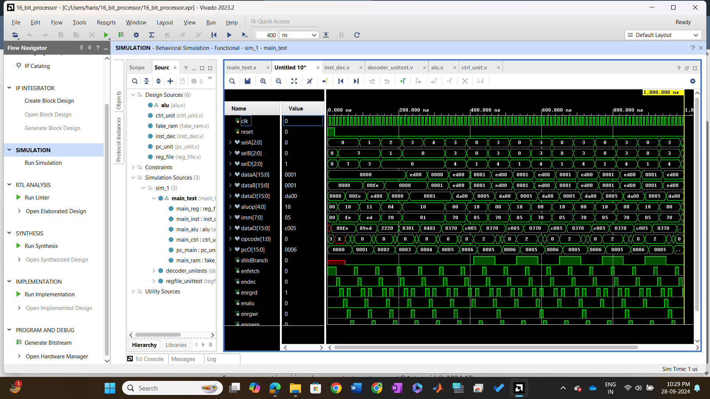
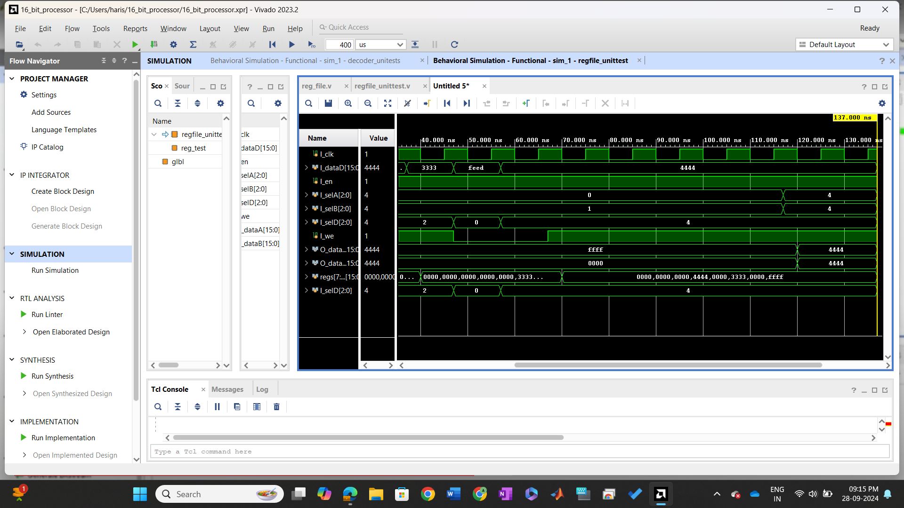
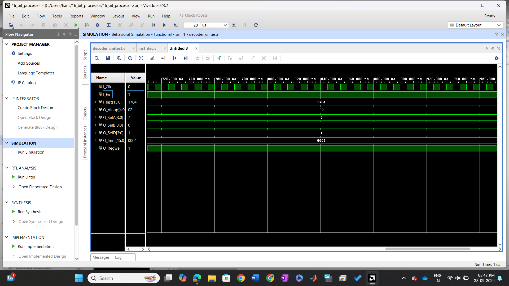

# 16-Bit RISC Processor

## Overview

The **16-Bit RISC Processor** is a digital design project implemented using **Verilog HDL**. The processor follows a **Reduced Instruction Set Computing (RISC)** architecture, designed to perform basic arithmetic, logical operations, and control functions. It consists of multiple components such as the **ALU**, **Control Unit**, **Program Counter**, and **Register File**, all verified through **testbenches**. The project demonstrates a basic 16-bit processor implementation and is used to explore fundamental digital design principles.

## Features

- 16-bit RISC processor with basic arithmetic and logical instructions.
- Modular design with key components: ALU, Control Unit, Program Counter, Register File.
- Simulated using testbenches to verify correct functionality of the design.
- Designed using Verilog HDL for FPGA-based implementation (optional).

## File Structure


```plaintext
16-Bit-RISC-Processor/
├── design/                # Verilog source files
│   ├── alu.v              # ALU module (Arithmetic Logic Unit)
│   ├── ctrl_unit.v        # Control unit module
│   ├── inst_dec.v         # Instruction decoder module
│   ├── pc_unit.v          # Program Counter unit
│   ├── reg_file.v         # Register file module
├── testbench/             # Testbench files
│   ├── main_test.v        # Top-level testbench for processor simulation
│   ├── regfile_unittest.v # Unit test for the Register File
│   ├── decoder_unitest.v  # Testbench for the Instruction Decoder
├── waveforms/             # Waveform images
│   ├── Main_test.png      # Waveform for main_test simulation
│   ├── Reg_unit_test.png  # Waveform for reg_unit_test simulation
│   ├── Instruction_Decoder_Unit_Test.png # Waveform for instruction decoder test
└── README.md              # Project documentation
```
## Design Components
## 1.ALU (Arithmetic Logic Unit) (alu.v):
The ALU performs basic arithmetic and logical operations such as addition, subtraction, AND, OR, etc. It operates on 16-bit inputs and outputs the result.

## 2.Control Unit (ctrl_unit.v):
The Control Unit interprets the opcode from the instruction and generates the corresponding control signals for the processor components, guiding the execution flow.

 ## 3.Instruction Decoder (inst_dec.v):
The Instruction Decoder decodes the incoming instruction and generates control signals for each part of the processor, directing data flow and operation execution.

## 4.Program Counter (PC) Unit (pc_unit.v):
The PC Unit manages the Program Counter, which stores the address of the next instruction to be executed. It is updated with each clock cycle.

## 5.Register File (reg_file.v):
The Register File stores data in a set of registers. It allows read and write access to the registers during instruction execution.

## Testbenches and Unit Tests
## 1.main_test.v:
The top-level testbench that simulates the entire processor design, feeding it various instructions to verify the correct operation of all components.

## 2.regfile_unittest.v:
A unit test specifically designed for testing the Register File module to ensure it can correctly store and retrieve data.

## 3.decoder_unitest.v:
A testbench for the Instruction Decoder to validate that instructions are decoded correctly and the control signals are properly generated.

## Waveforms


1. Main Test Simulation


2. Register Unit Test Simulation


3. Instruction Decoder Unit Test Simulation



## Getting Started
## Prerequisites
Xilinx Vivado or any Verilog simulator (for synthesis and simulation).
Basic understanding of Verilog HDL.
A compatible FPGA board (optional for hardware implementation).
## Installation
1.Clone the repository:
```plaintext
git clone https://github.com/PANGAHARISH/Xilinx-Vivado-Verilog-Projects.git
```
2.Navigate to the project folder:

```plaintext
cd 16-Bit-RISC-Processor
```

3.Open the project in Xilinx Vivado:
Open Vivado and create a new project.
Import the Verilog files from the design/ folder into the Vivado project.

4.Run the simulation:
Open the main_test.v testbench file in Vivado and run a simulation to verify the functionality.

## Running the Simulation
To run a simulation:

Open Vivado and load the project.
Set the simulation run options for the testbench file main_test.v.
Run the simulation and observe the waveforms to verify that the processor performs as expected.

## License

This project is licensed under the MIT License - see the [LICENSE](./LICENSE) file for details.


## Acknowledgments
Special thanks to the mentors at Apsis Solutions for providing the opportunity to work on this project.
Thanks to the open-source Verilog community for their contributions and resources.
