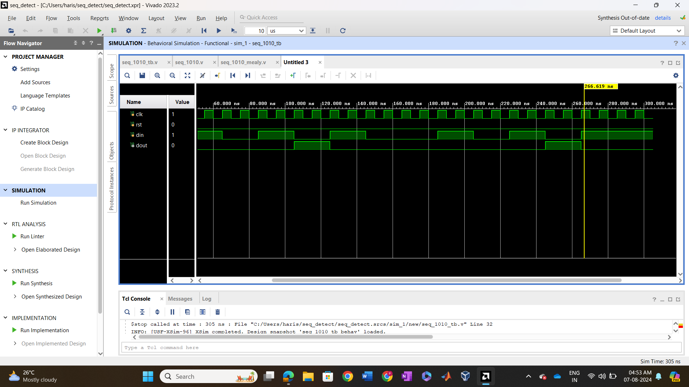
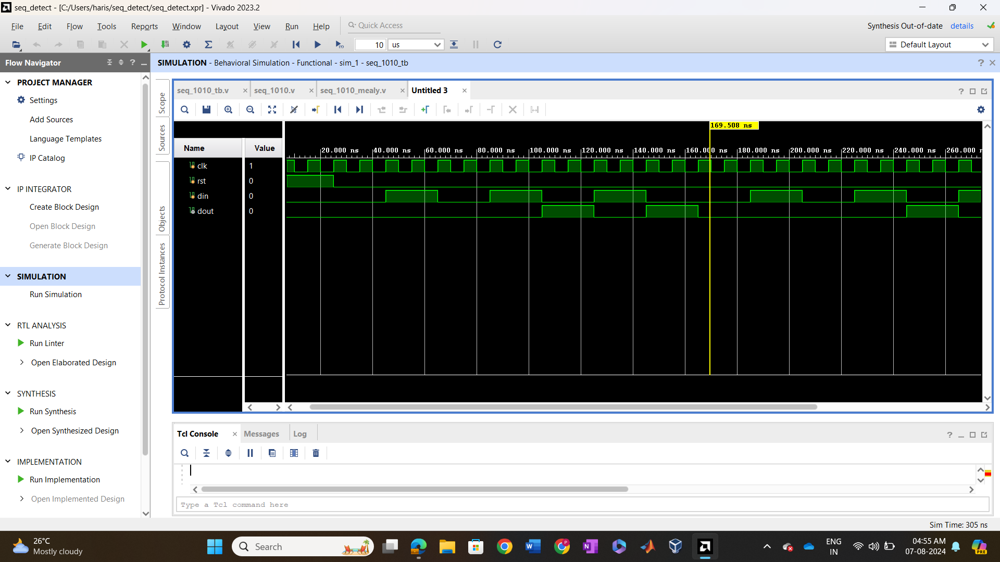
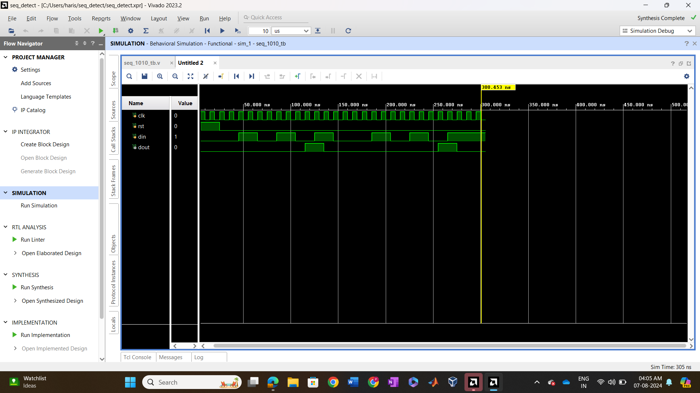
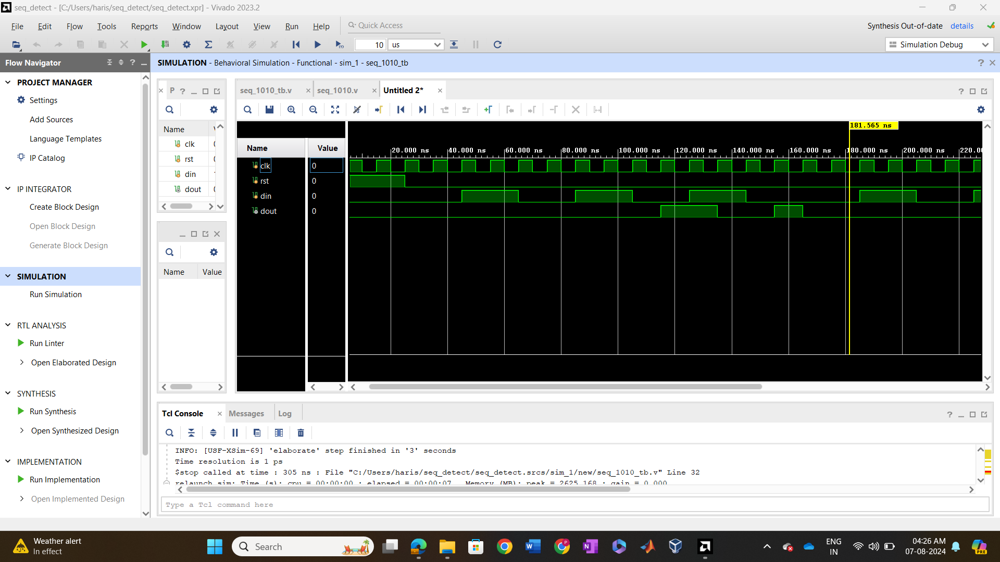

# Sequence Detector

## Overview

The **Sequence Detector** project is a digital design implemented using **Verilog HDL**. The sequence detector is designed to detect a specific 4-bit sequence, **1010**, from a stream of input bits. Two different finite state machine (FSM) implementations are provided for detecting the sequence: one using a **Moore machine** and another using a **Mealy machine**. Both designs are tested with their respective testbenches.

## Features

- Sequence detection for the pattern `1010`.
- Implemented using **Verilog HDL** for simulation and synthesis.
- Two FSM implementations: **Moore machine** and **Mealy machine**.
- Separate testbenches for each FSM design.
  
## File Structure

```plaintext
Sequence-Detector/
├── design/                        # Verilog source files
│   ├── seq_1010_mealy.v           # Mealy machine implementation
│   ├── seq_1010_moore.v           # Moore machine implementation
├── testbench/                     # Testbench files
│   ├── seq_1010_mealy_tb.v        # Testbench for the Mealy machine
│   ├── seq_1010_moore_tb.v        # Testbench for the Moore machine
├── Waveforms/      # Folder containing waveform images
│   ├── Mealy_Non_Overlapping.png  # Waveform for Mealy non-overlapping
│   ├── Mealy_Overlapping.png      # Waveform for Mealy overlapping
│   ├── Moore_Non_Overlapping.png  # Waveform for Moore non-overlapping
│   ├── Moore_Overlapping.png      # Waveform for Moore overlapping
└── README.md                      # Project documentation
```
## Design Components
## 1. Mealy Machine (seq_1010_mealy.v)
The Mealy machine implementation of the sequence detector generates an output based on both the current state and the input. It detects the sequence 1010, and the output is 1 when the sequence is detected and 0 otherwise. The output is immediately generated based on the current input and state.

## 2. Moore Machine (seq_1010_moore.v)
The Moore machine implementation of the sequence detector generates an output based solely on the current state. It detects the sequence 1010 by transitioning through states based on the input sequence. The output is 1 when the sequence is detected, otherwise 0.

## Testbenches
## 1. seq_1010_mealy_tb.v
This is the testbench for simulating the Mealy machine sequence detector. It applies various input sequences to verify that the Mealy machine correctly detects the sequence 1010. The testbench compares the expected output with the actual output and ensures that the design works correctly.

## 2. seq_1010_moore_tb.v
This is the testbench for simulating the Moore machine sequence detector. It applies various input sequences to verify that the Moore machine correctly detects the sequence 1010. The testbench compares the expected output with the actual output and ensures that the design works correctly.
## Waveforms

### Mealy Machine (Non-Overlapping Output)



### Mealy Machine (Overlapping Output)



### Moore Machine (Non-Overlapping Output)



### Moore Machine (Overlapping Output)



## Getting Started
Prerequisites
Xilinx Vivado or any Verilog simulator (for synthesis and simulation).
Basic understanding of Verilog HDL.
A compatible FPGA board (optional for hardware implementation).

Installation
1.Clone the repository:
```plaintext
git clone https://github.com/PANGAHARISH/Xilinx-Vivado-Verilog-Projects.git
```
2.Navigate to the project folder:
```plaintext
cd Sequence-Detector
```
3.Open the project in Xilinx Vivado:
Open Vivado and create a new project.
Import the Verilog files seq_1010_mealy.v (Mealy machine) and seq_1010_moore.v (Moore machine) from the design/ folder into the Vivado project.

4.Run the simulation:
Open the seq_1010_mealy_tb.v testbench file for the Mealy machine and seq_1010_moore_tb.v testbench file for the Moore machine.
Run simulations to verify the functionality of both FSM implementations.

## Running the Simulation
To run a simulation:
Open Vivado and load the project.
Set the simulation run options for the testbench files seq_1010_mealy_tb.v (for Mealy) and seq_1010_moore_tb.v (for Moore).
Run the simulations and observe the waveform to verify that both sequence detectors work as expected for their respective FSMs.
## License

This project is licensed under the MIT License - see the [LICENSE](./LICENSE) file for details.


## Acknowledgments
Special thanks to the mentors at Apsis Solutions for providing the opportunity to work on this project.
Thanks to the open-source Verilog community for their contributions and resources.
