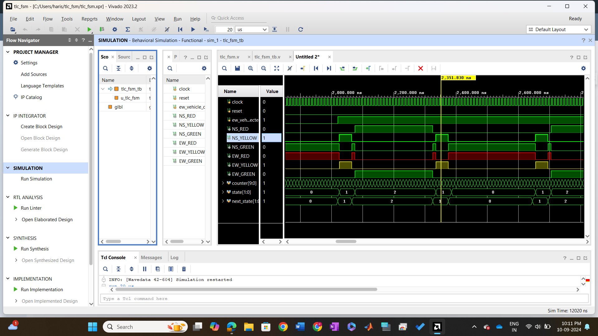

# Traffic Light Controller

## Overview

The **Traffic Light Controller** is a digital design project implemented using **Verilog HDL**. It simulates a traffic light system for controlling the traffic flow at an intersection. The system operates on a simple finite state machine (FSM) that transitions through states such as **Green**, **Yellow**, and **Red** for the traffic lights, ensuring orderly traffic movement.

## Features

- Traffic light system that handles 4 traffic directions.
- Finite State Machine (FSM) for state transitions (Green, Yellow, Red).
- Designed using **Verilog HDL** for simulation and synthesis.
- Testbenches provided for simulation and validation.

## File Structure

```plaintext
Traffic-Light-Controller/
├── design/                      # Verilog source files
│   ├── tlc_fsm.v                # FSM for the traffic light controller
├── testbench/                   # Testbench files
│   ├── tlc_fsm_tb.v             # Testbench for the traffic light controller
├── Waveforms/                    # Folder containing waveform images
│   ├── Traffic Light Controller Waveform.png         # Waveform for the traffic light controller
└── README.md                    # Project documentation
```

## Design Components
1. Finite State Machine (FSM) (tlc_fsm.v)
The Finite State Machine (FSM) defines the logic for the traffic light system. The FSM cycles through three states:

Green: The light is green, allowing vehicles to pass.
Yellow: The light is yellow, indicating a change to red.
Red: The light is red, stopping vehicles.
The FSM transitions between these states based on a clock signal, simulating the behavior of a traffic light system.

## Testbenches
1. tlc_fsm_tb.v
This testbench simulates the Traffic Light Controller FSM, applying clock signals to verify the correctness of the FSM's state transitions. It tests whether the traffic lights change between Green, Yellow, and Red as expected.

## Waveforms
### Traffic Light Controller Waveform


## Getting Started
Prerequisites
Xilinx Vivado or any Verilog simulator (for synthesis and simulation).
Basic understanding of Verilog HDL.
A compatible FPGA board (optional for hardware implementation).

## Installation
1.Clone the repository:
```plaintext
git clone https://github.com/PANGAHARISH/Xilinx-Vivado-Verilog-Projects.git
```
2.Navigate to the project folder:
```plaintext
cd Traffic-Light-Controller
```
3.Open the project in Xilinx Vivado:

Open Vivado and create a new project.
Import the Verilog file tlc_fsm.v from the design/ folder into the Vivado project.
4.Run the simulation:
Open the tlc_fsm_tb.v testbench file in Vivado.
Run a simulation to verify the functionality.

## Running the Simulation
To run a simulation:

Open Vivado and load the project.
Set the simulation run options for the testbench file tlc_fsm_tb.v.
Run the simulation and observe the waveform to verify the correct operation of the traffic light system.
## License
This project is licensed under the MIT License - see the LICENSE file for details.

## Acknowledgments
Special thanks to the mentors at Apsis Solutions for providing the opportunity to work on this project.
Thanks to the open-source Verilog community for their contributions and resources.
